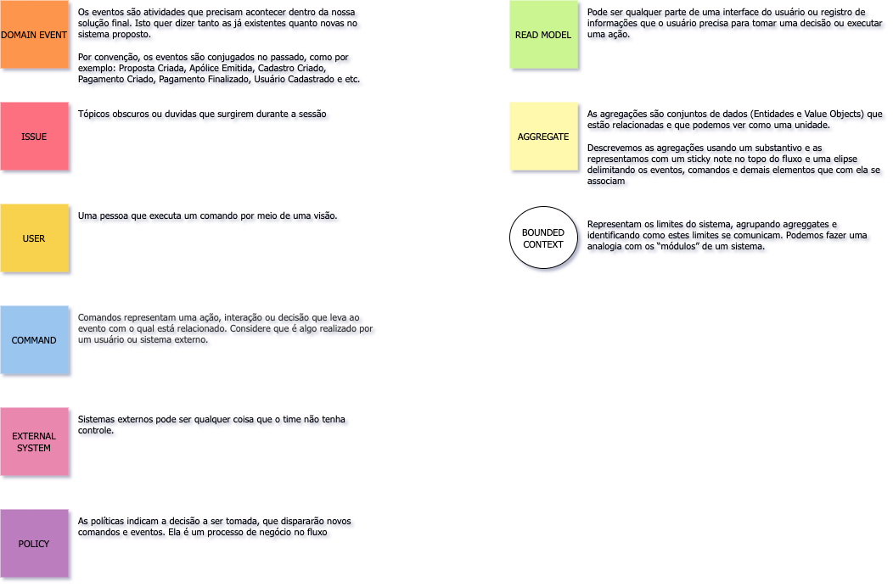

# Event Storming

## Introdução

### O que é Event Storming?

Event Storming é uma técnica de design rápido que engaja especialistas do domínio de negócios com desenvolvedores para que alcancem um ciclo rápido de aprendizagem (aprender o máximo possível no menor tempo possível), focando mais nos processos de negócio do que em abstrações técnicas (classes, entidades…)

Principais vantagens:
- Acelera a aprendizagem de grupo, aprende-se em poucas horas o que geralmente poderia levar dias ou semanas
- Promove o engajamento entre os especialistas de domínio e o time técnico
- Ao final, é possível ter esboços do que serão futuros testes de aceitação, interfaces de serviços, atores envolvidos

### O que não e Event Storming?

Apesar de ter vários conceitos em comum com DDD (Domain Driven Design) e Event Sourcing, o Event Storming não é voltado apenas para desenvolvimento de software. A ideia é que todos os envolvidos participem, para gerar uma linguagem que possa ser usada tanto pelos desenvolvedores quanto pelos detentores do conhecimento de negócios.
No Event Storming não discutimos sobre implementação então, mais tarde, a equipe de desenvolvimento pode selecionar a melhor arquitetura de código necessária para obter os resultados esperados.

### Informações gerais

**Setup inicial**

1. Pessoas: entre 6 a 10
2. Preparação: 20 min
3. Tempo: 3 a 6 hrs (é importante salientar que se tentarmos mapear o software todo de uma vez essa dinâmica pode demorar mais de 6hrs)
4. Dificuldade: alta

**Quem deve participar?**

- Pessoas que sabem as perguntas: Normalmente são pessoas técnicas com: Engenheiros de software, testes e etc. 
- Pessoas que sabem as respostas: Normalmente são os especialistas de domínio, pessoas que trabalham dia a dia com esses desafios 
- Facilitador: Scrum master, product owner ou arquiteto

## Terminologia

## Flow

## Building blocks

