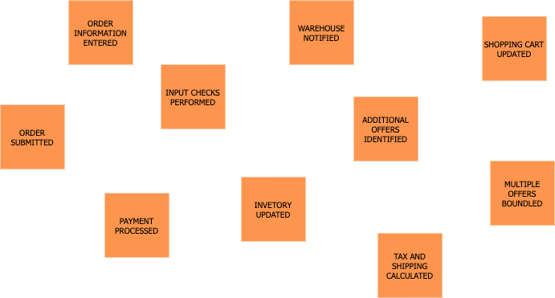
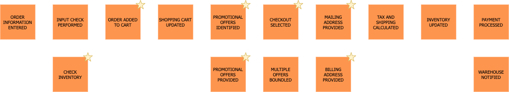
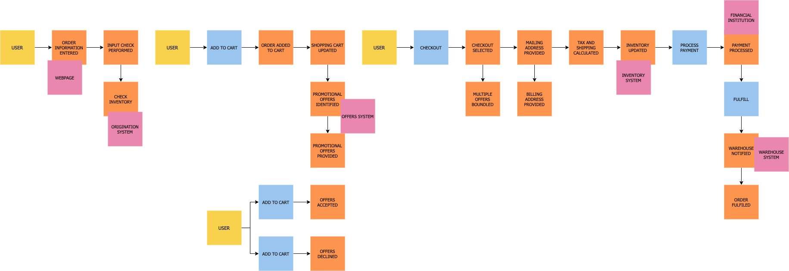
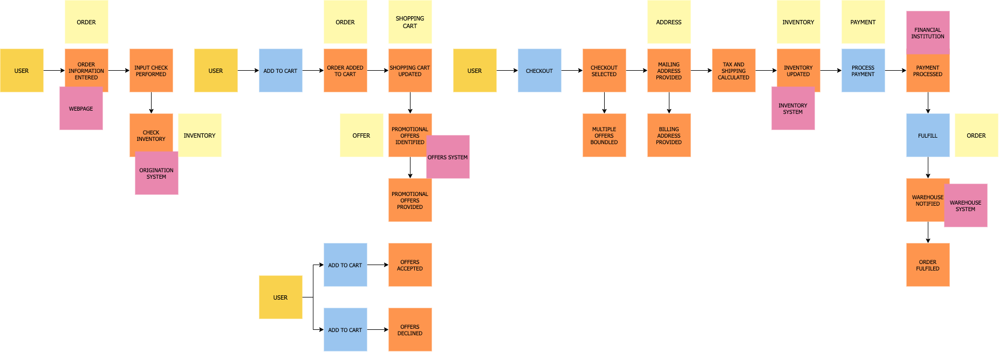
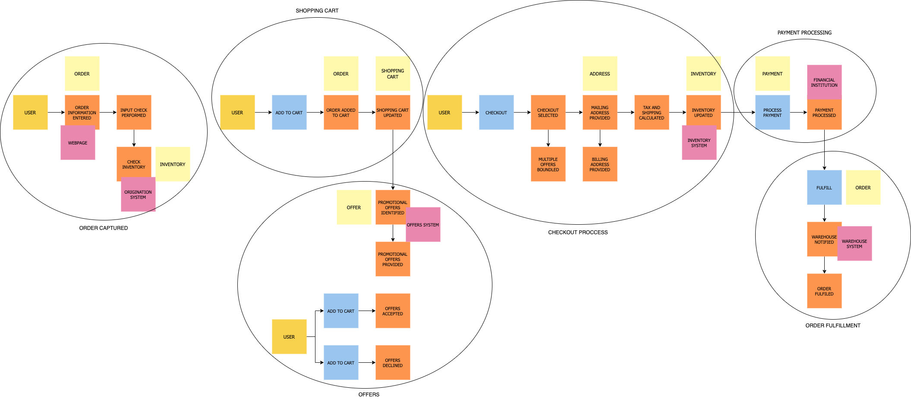
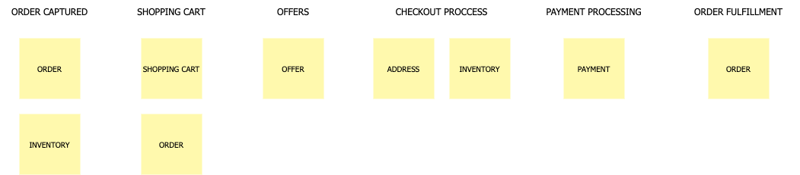

# Etapas
Em nossas etapas vamos utilizar como exemplo o processo de pedido de um _e-commerce_.

## Preparação
Nesse momento é que devemos nos certificar qual área que iremos modelar/desenvolver (quanto mais extenso o processo de negócio, mais tempo a dinâmica leva)

## Descoberta dos eventos de domínio
Nesse momento levantamos todos o eventos que são importantes para o negócio (é importante que o verbo do eventos esteja no passado e que os eventos sigam uma ordem cronológica)

Basicamente, todos na sala estão escrevendo eventos. Devemos tratar essa fase como um brainstorming, portanto, devemos evitar aplicar qualquer análise ou filtragem nesta fase, pois isso apenas atrasará as coisas.

## Colocando os eventos em ordem
A segunda etapa, ajuda a identificar quaisquer eventos ausentes, colocando os eventos em sequência (geralmente da esquerda para a direita). Depois que a ordem for estabelecida, podemos retroceder para ajudar a identificar eventos adicionais.

Nessa etapa também é importante que os especialistas de domínio expliquem o que é cada um dos eventos mapeados. Dessa maneira, conseguimos unificar os sinônimos, aprimorar as diferenças e validar a ordem temporal.

Nota!: Eventos sinalizados com estrela, foram novos eventos identificaos ao refinar o fluxo.

## Modelando ecossistema mais amplo em torno dos eventos
Identificar causas (de onde vem os eventos de domínio). Existem quatro principais

1.  Ações do usuário  
2.  Sistemas externos    
3.  Tempo    
4.  Reações automáticas    

Nessa etapa fazemos perguntas como:

1.  O que desencadeou o evento? É um sistema? Um usuário? Outro evento?    
2.  Quais eventos acionam quais políticas?    
3.  Quais políticas chamam novos comandos?   

## Categorização simples dos eventos
Neste ponto, todos os eventos detalhados e suas partes relacionadas devem ser modelados e conforme você se prepara para passar para a categorização.

A primeira categorização é conhecida como agregados. Estes são os substantivos, ou as coisas, sobre as quais os eventos operam. O DDD também tem um conceito de entidades, que você pode considerar como o próximo nível abaixo dos agregados. Tratar o agregado e a entidade como o mesmo ajuda a simplificar as coisas, tornando mais fácil para as pessoas entenderem. No exemplo de processo de pedido, Inventário, Pedido, Oferta são todos exemplos de agregados. São as coisas sobre as quais os eventos estão operando.

## Categorização de eventos de contexto limitado
Agora estamos prontos para o nível de categorização de **contexto limitado .** Todos os eventos relacionados cairiam em um único contexto limitado. Por exemplo, todos os eventos relacionados a um carrinho de compras estariam dentro de um contexto limitado a um carrinho de compras. Um conceito importante de _microservice_ a ser lembrado aqui é que, se ele mudar junto, deve seguir junto.  Queremos eliminar ao máximo as dependências em contextos limitados. Se o idioma mudar entre os eventos, isso é um sinal de que você cruzou para um contexto limitado diferente.

## Definindo microservices
Nessa etapa usamos os contextos limitados e os agregados para entender os _microservices_ necessários. Normalmente, um agregado dentro de um contexto limitado representa um ou mais _microservices_.

Nesse exemplo, o contexto limitado do **pedido capturado** terá _microservices_ relacionados ao pedido e ao inventário. Podemos notar que o pedido também existe no contexto limitado do **carrinho** de compras e no contexto limitado do **atendimento de pedido**. Não há problema, pois indica que são _microservices_ diferentes, pois estão em diferentes contextos limitados. Ambos podem estar fazendo coisas relacionadas a um pedido, mas o que estão fazendo é diferente. Em um aplicativo monolítico, eles seriam agrupados criando acoplamento, mas com uma arquitetura de _microservices_, os separamos para independência.