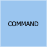
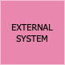
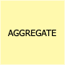
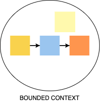

# Terminologia
| Sticker | Descrição |
|-------|-----------|
|  | Os eventos são atividades que precisam acontecer dentro da nossa solução final. Isto quer dizer tanto as já existentes quanto novas no sistema proposto.   Por convenção, os eventos são conjugados no passado, como por exemplo: Proposta Criada, Apólice Emitida, Cadastro Criado, Pagamento Criado, Pagamento Finalizado, Usuário Cadastrado e etc. |
|  | Uma pessoa que executa um comando por meio de uma visão.|
|  | Comandos representam uma ação, interação ou decisão que leva ao evento com o qual está relacionado. Considere que é algo realizado por um usuário ou sistema externo. |
|  | As políticas indicam a decisão a ser tomada, que dispararão novos comandos e eventos. Ela é um processo de negócio no fluxo. |
|  | Sistemas externos pode ser qualquer coisa que o time não tenha controle. |
|  | Pode ser qualquer parte de uma interface do usuário ou registro de informações que o usuário precisa para tomar uma decisão ou executar uma ação. |
|  | As agregações são conjuntos de dados (Entidades e Value Objects) que estão relacionadas e que podemos ver como uma unidade.   Descrevemos as agregações usando um substantivo e as representamos com um sticky note no topo do fluxo e uma elipse delimitando os eventos, comandos e demais elementos que com ela se associam.|
|  | Tópicos obscuros ou duvidas que surgirem durante a sessão. |
|  | Representam os limites do sistema, agrupando agreggates e identificando como estes limites se comunicam. Podemos fazer uma analogia com os "módulos" de um sistema. "